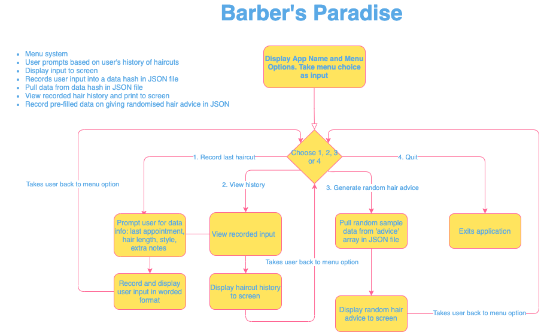

##### By Karla Tolentino
# T1A3 - "Barber's Paradise" Terminal Application

## Table of Contents
- [GitHub Repository](#github-repository)
- [Purpose and Scope](#purpose-and-scope)
- [Functionality and Features](#functionality-and-features)
- [User Interaction and Experience](#user-interaction-and-experience)
- [Diagram](#diagram)
- [Implementation Plan](#implementation-plan)
- [HELP DOCUMENTATION](#help-documentation)
- [Running the app](#running-the-app)
- [Dependencies](#dependencies)
- [System/Hardware Requirements](#system-and-hardware-requirements)

## GitHub Repository
https://github.com/karlatolentino/T1A3---Terminal-App

## Purpose and Scope

## Functionality and Features
* **1. Menu Option and Welcome Screen**

* **2. Record Hair Cuts**

* **3. View Past Hair Cuts**

* **4.Generate Random Hair Tip**

* **5Exit**

## User Interaction and Experience

## Diagram
Flowchart diagram for *Barber's Paradise* terminal application:

## Implementation Plan

## HELP DOCUMENTATION

## Running the app
Execute Bash script `./runner.sh` to run application. If permission denied, run `ruby index.rb` to launch terminal application

## Dependencies
Use `bundle install` to install all dependencies used for this application.

## System and Hardware Requirements

## Testing
For my terminal application *Barber's Paradise*, I created a spreadsheet to manually test the functions of my program.

Due to insufficient time, I was unable to complete testing for user input in the **Record Haircut**