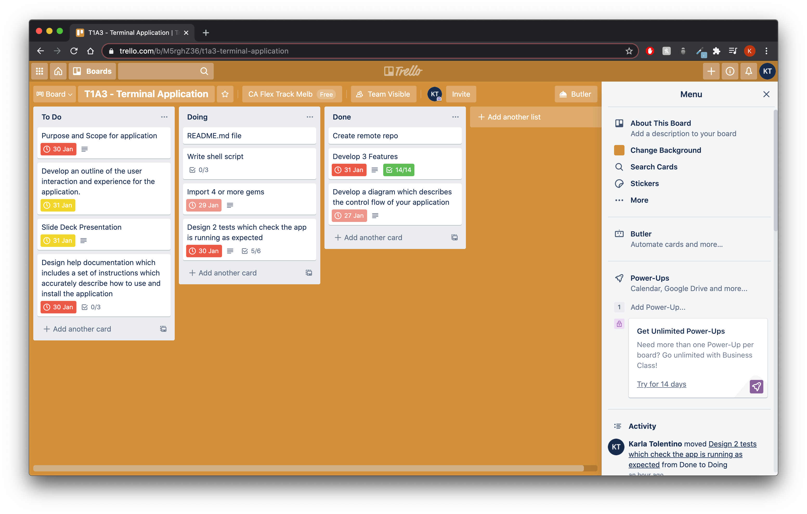
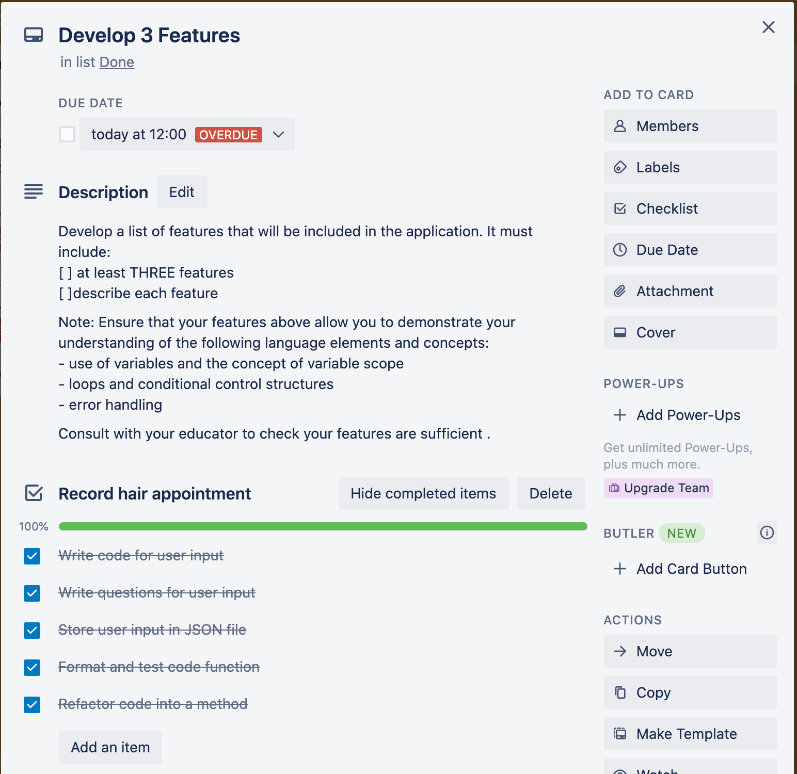
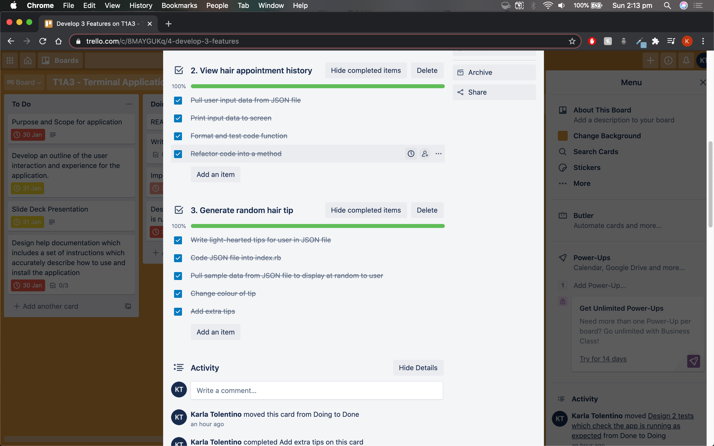
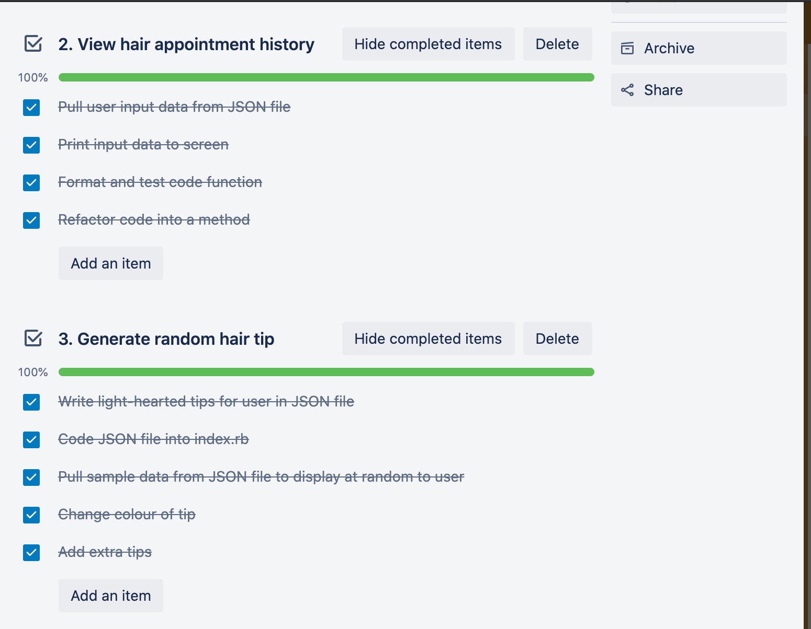
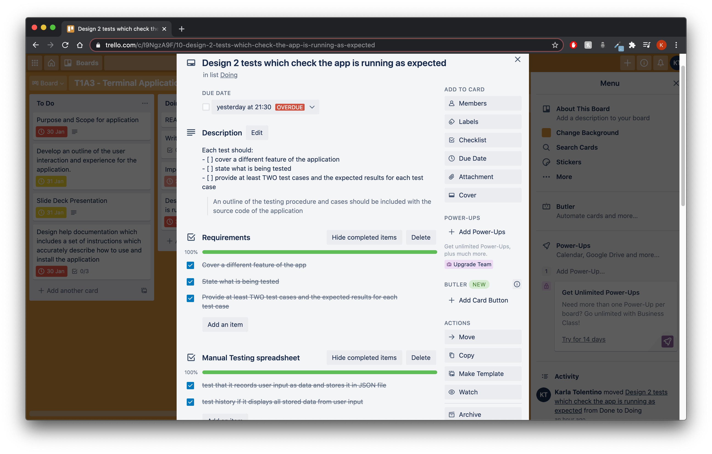
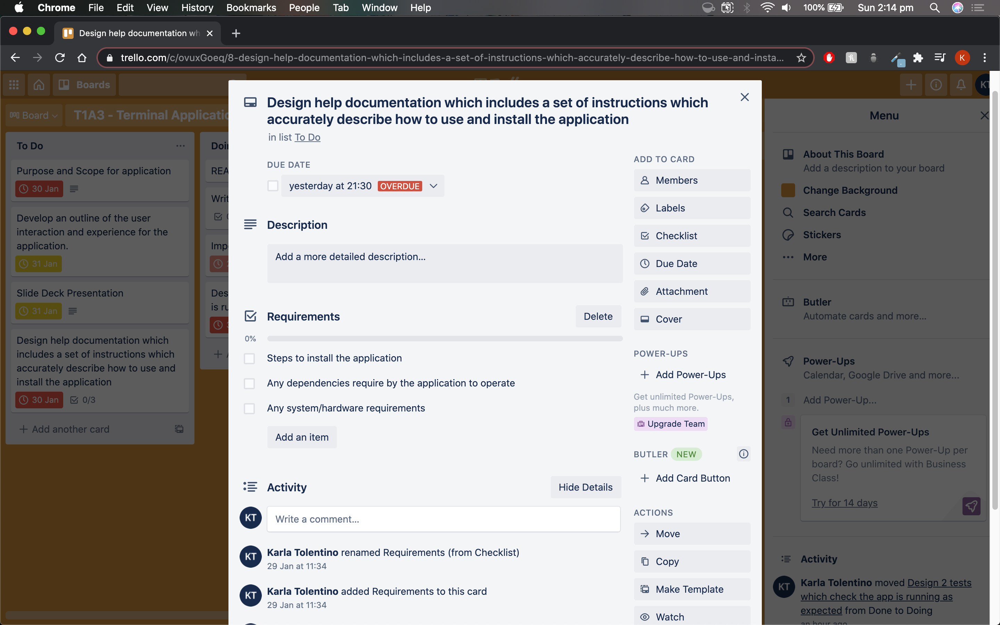
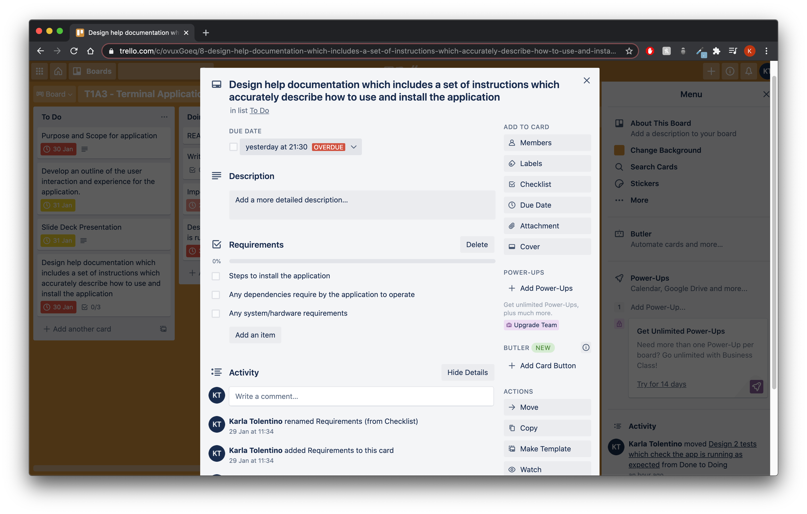

##### By Karla Tolentino
# T1A3 - "Barber's Paradise" Terminal Application

## Table of Contents
- [GitHub Repository](#github-repository)
- [Purpose and Scope](#purpose-and-scope)
- [Functionality and Features](#functionality-and-features)
- [User Interaction and Experience](#user-interaction-and-experience)
- [Diagram](#diagram)
- [Implementation Plan](#implementation-plan)
- [HELP DOCUMENTATION](#help-documentation)
- [Running the app](#running-the-app)
- [Dependencies](#dependencies)
- [System/Hardware Requirements](#system-and-hardware-requirements)

## GitHub Repository
https://github.com/karlatolentino/T1A3---Terminal-App

## Purpose and Scope
*Barber's Paradise* is a terminal application created for hairdressing clients who want to keep track of their past haircuts and what their styling preferences are to bring in to their next visit at the barbershop! As the creator of this application is a barber by trade, this concept was curated with the barber and client's direction in mind.

The *purpose* of this app is to help users remember what they have had previously done to their hair and to communicate their wants and needs better to the barber or hairdresser. At the barbershop, time is money but the quality of service is of utmost importance. *Barber's Paradise* aims to cut down errors of communication between barber and client by having the user track their hair history and provide a less awkward way to explain their preferences when they are seated with a new barber at the shop.

The *target audience* for this application is directed towards users who go to barbershops or men's salons to get their haircuts. The majority of clients who attend these salons usually rely on the hairdresser or barber to obtain their past haircut preferences.  Often times, clients switch between different hairdressers or barbers and can have different expectations of what the client's needs are. By creating this app, bridging the communication gap between barber and client can increase client satisfaction and boost the overall experience at the shop. *Barber's Paradise* offers a half-way point for the client to take note of their own haircut preferences so they are able to better communicate their needs.

The user will be able to navigate options to record new haircuts, view their past haircuts and even generate a helpful tip to look after their hair and their experience at the shop.

## Functionality and Features
* **1. Menu Option and Welcome Screen**

Upon launching the app, the user is greeted by the name of the program called *Barber's Paradise*. The user is then given four options to choose from by navigating the options using the up and down arrows and pressing 'Enter' to select the option. The four options are explained below.

* **2. Record Haircut**

By choosing this feature from the menu option, the program will ask the user for input to collect and store data. The inputs for this feature involve retrieving information on the following:
- the date of their previous haircut experience
- the hair length that was given measured in millimeters
- whether or not the user used hair clippers
- a description of their hair style
- whether or not they used product for styling
- any additional notes on the haircut and/or experience

After obtaining this data from the user, it will save the input into a separate JSON file in the application and be stored for viewing in the next feature below.

* **3. View Haircut History**

Choosing this feature from the menu option will display a list of all of the recorded haircut data that have been collected from the user. The order of history will be displayed to screen to the user from oldest entry to newest entry.

If no previous entry has been recorded, the application will run a message saying that it is empty.

* **4.Generate Random Hair Tip**

Choosing this feature from the menu option will generate a random hair tip to display to the user. The descriptions of these tips range from helpful advice to consider when visiting your next barbershop or salon. The tips also contain advice on looking after your hair and yourself.

## User Interaction and Experience
This app is designed to keep communication between client and hairdresser as smooth as possible. With this in mind, the user interface and experience for this app is quite simple and easy to navigate. Users will be able to view all options for the application via a menu selection upon launching. They will be advised to scroll through options using arrow keys and press enter. The colour theme selected for use in the application are the traditional barber pole colours: white, blue and red 💈.

When using the *"record haircut"* feature, the user will be prompted a series of questions for them to answer as to obtain as much information on their haircut as possible. This will then be collected and stored in the application.

When using the *"view haircut history"* feature, the user will be able to view any of their past haircuts that have been recorded on the app. If there are a few entries to view, the user will be able to scroll through them.

When using the *"generate random hair tip"* feature, clients who use this application will be given some helpful advice to maintain their grooming and provide a light-hearted sense of humour for them to bring into the shop. Afterall, barbers do love a good banter!

## Diagram
Flowchart diagram for *Barber's Paradise* terminal application:

## Implementation Plan

For the 4 main features of this app, I have developed an extensive implemenation plan involving check lists for each feature.

*1. Menu Option and Welcome Screen*
Checklist:
- [] Write description for welcome screen
- [] Write menu options
- [] Initialise git repo
- [] Use tty-prompt gem to create multi-selection options
- [] Format and test code

Timeframe: 2 hrs

*2. Record Haircut*
Checklist
- [] Write code for user input
- [] Write prompts for user input
- [] Store user input in JSON file by pushing input into JSON hash
- [] Format data and display information to user
- [] Refactor some code into methods
- [] Use gem to change colour of text

Timeframe: 6 hrs

*3. View Haircut History*
Checklist
- [] Pull user input data from JSON file
- [] Print input data to screen
- [] Format and test code function
- [] Refactor code into methods
- [] Use gem to change colour of text

Timeframe: 3 hrs

*4.Generate Random Hair Tip*
- [] Write light-hearted tips in JSON file as hash array
- [] Code JSON file into index.rb
- [] Pull sample data from JSON hash file to display at random to user
- [] Change colour of tip description
- [] Add additional tips

Timeframe: 3 hrs

I used Trello to keep track of and manage my project throughout this assignment. Below are screenshots of my implementation plan:

**Error Handling**
All inputs have been manually tested for error. As the main feature relies heavily on documentation for users recording haircuts, the prompts will take in strings to output to user to best describe their experience. Any insufficient input will be redirected to the prompt until program is satisfied.

## Help Documentation
Find the help documentation [here](./docs/help.txt).

## Testing
For my terminal application *Barber's Paradise*, I created a spreadsheet to manually test the functions of my program.

Due to insufficient time, I was unable to complete and pass testing for user input in the **Record Haircut** feature where the user is prompted input for date and guard number. The program will still take and record user input as data and will display in the history.

**Please refer to the manual testing spreadsheet located in (./docs/manual_testing_spreadsheet.xlsx)**

Take me [there](./docs/manual_testing_spreadsheet.xlsx). Open in Microsoft Excel or Numbers.
Or open the PDF version [here](./docs/manual_testing_spreadsheet1.pdf).